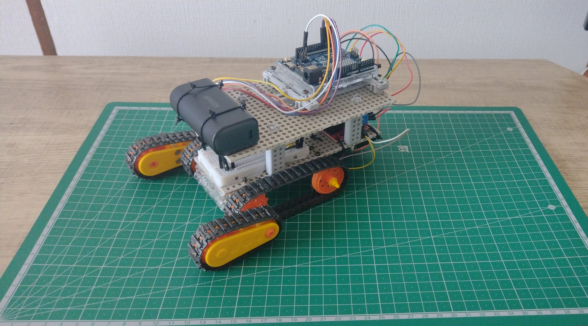

# Arduino Arm Crawler Remote Control - プロジェクトレジュメ

## 📋 プロジェクト概要

**プロジェクト名**: Arduino Arm Crawler Remote Control  
**開発期間**: 2024年  
**開発者**: tmomo086 (X: くろT@mirai_sousiyo39) + AI駆動開発 (Grok 3 + Claude 4 + Cursor + ClaudeCode)  
**プロジェクト種別**: IoTロボット制御システム / モバイルアプリ開発

### プロジェクト説明
タミヤのアームクローラー工作キットをベースに、Arduino Uno R4 WiFiとAndroidアプリを使用してBLE（Bluetooth Low Energy）でワイヤレス制御するIoTシステムを開発。**AI駆動開発手法**を段階的に活用し、初期開発ではWinPython環境でGrok 3、Claude 4、Cursorを使用し、Streamlit対応時にはClaudeCodeを活用した開発プロセスを実践。入門的なロボット制御システムを構築。

## 🎯 技術的成果

### 主要機能
- **リアルタイム制御**: 前進・後退・左右旋回・停止の即座な応答
- **10段階速度調整**: PWM制御による精密なスピードコントロール
- **BLE通信**: 低遅延（約50ms）での安定通信
- **直感的UI**: タッチベースの操作インターフェース

### パフォーマンス指標
| 項目 | 仕様/性能 |
|------|-----------|
| 通信遅延 | < 50ms |
| 動作範囲 | 約10m（屋内環境） |
| 速度範囲 | 0.1m/s - 0.8m/s |
| Arduino稼働時間 | 約8時間 |
| モーター稼働時間 | 約1時間（乾電池5本） |
| 対応Android | 8.0+ |

## 🛠️ 使用技術・ツール

### ハードウェア
- **メインコントローラ**: Arduino Uno R4 WiFi
- **モータードライバー**: L298N Motor Driver
- **ベース車体**: タミヤ アームクローラー工作キット
- **電源**: 単3乾電池 × 5本

### ソフトウェア・開発環境
- **ファームウェア**: C++ + ArduinoBLE ライブラリ
- **モバイルアプリ**: Kotlin + Bluetooth LE API
- **初期開発環境**: WinPython + Grok 3 + Claude 4 + Cursor
- **Streamlit対応**: ClaudeCode によるWebアプリケーション開発
- **従来型IDE**: Arduino IDE, Android Studio
- **バージョン管理**: Git
- **AI支援機能**: 初期コード生成・編集・デバッグ・ドキュメント整備・Webアプリ開発

### 通信プロトコル設計
- **通信方式**: BLE (Bluetooth Low Energy)
- **Service UUID**: `19B10000-E8F2-537E-4F6C-D104768A1214`
- **Characteristic UUID**: `19B10001-E8F2-537E-4F6C-D104768A1214`
- **コマンド体系**: 
  - 方向制御: `F`(前進), `B`(後退), `L`(左旋回), `R`(右旋回), `S`(停止)
  - 速度制御: `0`-`9` (0=停止, 9=最高速度)

## 📁 システム構成

### プロジェクト構造
```
arduino-arm-crawler/
├── firmware/
│   └── arm_crawler_controller.ino    # Arduinoファームウェア（C++）
├── app/
│   └── app/src/main/
│       ├── java/com/example/armcrawlercontrol/
│       │   └── MainActivity.kt       # メインアプリロジック（Kotlin）
│       ├── res/layout/
│       │   └── activity_main.xml     # UIレイアウト定義
│       └── AndroidManifest.xml       # アプリケーション設定
├── hardware/
│   └── wiring_diagram.md            # 配線図・回路設計書
├── images/
│   ├── 20250718_145158.jpg         # 完成品画像
│   └── README.md                   # 画像説明
├── docs/
│   └── resume.md                   # プロジェクトレジュメ（本ファイル）
└── README.md                       # プロジェクト概要
```

### システムアーキテクチャ
```
[Android App] ←──BLE通信──→ [Arduino Uno R4 WiFi] ←──PWM制御──→ [L298N Driver] ←──→ [DCモーター]
```

## 💡 技術的な工夫・特徴

### 1. モジュール設計
- **関数分離**: 機能ごとに関数を分割し、保守性を向上
- **エラーハンドリング**: 接続切断時やコマンド異常時の安全停止機能
- **デバッグ機能**: シリアル出力による動作状況の可視化

### 2. 安全性への配慮
- **自動停止機能**: 通信エラー時の緊急停止
- **速度制限**: 安全な速度範囲での動作制限
- **バッテリー保護**: 過放電防止のための監視

### 3. スケーラビリティ
- **拡張可能な設計**: 新機能追加に対応した構造
- **調整可能なパラメータ**: 速度カーブやタイミングの調整可能

## 🚀 開発プロセス・手法

### AI駆動開発の実践
- **初期開発**: WinPython環境でGrok 3、Claude 4、Cursorを活用
- **Streamlit対応**: ClaudeCodeによるWebアプリケーション開発
- **開発手法**: プロトタイプ→テスト→改良のイテレーション
- **学習アプローチ**: 実践的な問題解決を通じた技術習得

### 開発段階
1. **要件定義**: 基本機能の策定
2. **ハードウェア設計**: 配線・回路設計
3. **ファームウェア開発**: Arduino制御プログラム
4. **アプリ開発**: Android UI・通信機能
5. **統合テスト**: システム全体の動作確認
6. **性能調整**: 遅延・速度の最適化

## 📈 習得した技術・スキル

### ハードウェア開発
- **Arduino プログラミング**: C++による組み込み開発
- **PWM制御**: モーター速度制御の実装
- **回路設計**: L298Nドライバーとの接続設計

### ソフトウェア開発
- **Android開発**: Kotlin + Android SDK
- **BLE通信**: Bluetooth Low Energy APIの活用
- **UI/UX設計**: 直感的な操作インターフェースの設計

### システム設計
- **IoT システム**: デバイス間通信の設計・実装
- **プロトコル設計**: 効率的な通信手順の策定
- **エラーハンドリング**: 堅牢なシステム設計

### 開発手法・ツール
- **バージョン管理**: Git を使った開発管理
- **AI駆動開発**: 段階的なAIツール活用（WinPython→Streamlit）
- **Webアプリ開発**: ClaudeCodeによるStreamlitアプリケーション構築
- **デバッグ**: ハードウェア・ソフトウェア両面での問題解決

## 🎬 デモンストレーション

### 実機動作
- **X（Twitter）投稿**: [動作確認動画](https://x.com/mirai_sousiyo39/status/1909121900678426879?t=9XamzxhPQmJzlQOsojcGTQ&s=19)
- **実際の操作**: [操作動画](https://x.com/i/status/1909567755181080726)

### 完成品画像


## 🏆 プロジェクトの意義・学習効果

### 技術的価値
- **統合システム開発**: ハードウェアとソフトウェアの統合経験
- **リアルタイム制御**: 即応性が求められるシステムの実装
- **無線通信**: IoTデバイス間通信の実践的理解

### 学習価値
- **AI駆動開発**: 段階的なAIツール活用（WinPython環境でのGrok 3、Claude 4、Cursor → ClaudeCodeによるStreamlit対応）
- **プロトタイピング**: アイデアから実機までの完結した開発体験
- **問題解決**: 技術的課題の特定と解決プロセス
- **AI支援プログラミング**: プロンプトエンジニアリングとコード品質管理
- **Webアプリ開発**: ClaudeCodeを活用したStreamlitアプリケーション構築

### 今後の展開可能性
- **機能拡張**: カメラ追加、センサー連携
- **制御高度化**: 自動運転機能、パターン学習
- **UI改善**: より直感的な操作インターフェース

## 📄 ライセンス・権利

**ライセンス**: MIT License  
**オープンソース**: GitHubで公開  
**利用制限**: なし（MIT License準拠）

---

**開発者情報**  
tmomo086 (X: @mirai_sousiyo39)  
AI駆動開発: 初期開発（WinPython + Grok 3 + Claude 4 + Cursor）→ Streamlit対応（ClaudeCode）

*本プロジェクトは、段階的なAI駆動開発の実践として、初期開発ではWinPython環境でGrok 3、Claude 4、Cursorを活用し、Streamlit対応時にはClaudeCodeを使用した開発プロセスを実践した教育・学習目的のオープンソースプロジェクトです。*